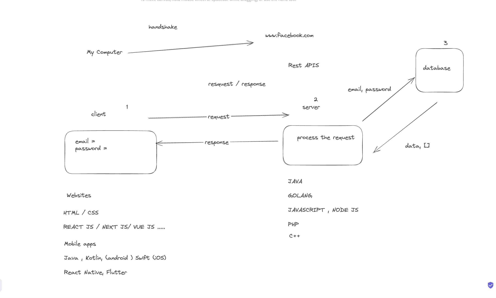
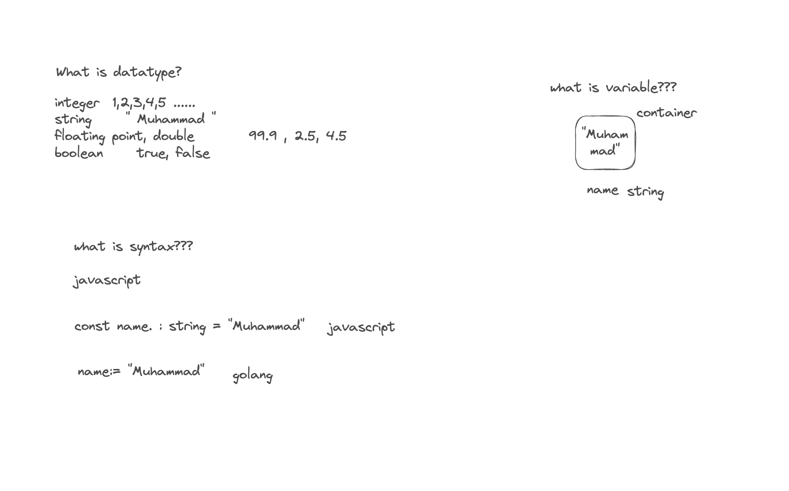

# Saastellar Bootcamp #001

**academy.saastellar.com**

Welcome to SaaStellar's Programming Lectures series! This comprehensive course is designed to take you from a coding novice to a proficient programmer. Our lectures cover a wide range of programming topics.

Each lecture is crafted to provide both theoretical knowledge and practical skills, ensuring you're well-equipped to tackle real-world programming challenges. Whether you're looking to start a career in software development or enhance your existing skills, SaaSteller's Programming Lectures offer the perfect blend of in-depth learning and hands-on experience.

By,

[Muhammad Qazi](https://github.com/muhammadqazi)

[Hosam Al-Hamwi](https://github.com/hosamalhamwi)


# Lecture #001 📌

1- How are web applications working?

2- what are the server and client sides, and how do they work?

3- Types of requests, requests headers, requests params, requests queries, request body

4- response types and statuses

5- how does the server process our requests

6- what is a database?

7- how we interact with the database

8- How do sessions and cookies work?

9- How do APIs work in backend development?

10- What are JSON and XML, and how are they used in web applications


# **\<u>Lecture #001 Material 📚\</u>**



The diagram appears to illustrate a client-server interaction model, likely focused on a REST API flow. Here's a breakdown of the key elements:

1. **Client (My Computer)**: This is labeled "My Computer," representing the user or client-side that initiates a request. It sends credentials (`email =`, `password =`) as part of the interaction, which is marked in a rectangle labeled "client."
2. **Arrows (Request/Response Flow)**: Several arrows depict the flow of information:
   * An arrow from the client to the server labeled "request," showing that the client sends a request to the server.
   * Another arrow labeled "response" shows the server processing the request and sending back a response.
3. **Server (**[**www.facebook.com**](http://www.facebook.com)**)**: The server is labeled with "[www.facebook.com](http://www.facebook.com)," possibly indicating an example of a REST API endpoint that the client interacts with. A rectangle labeled "server" represents the server that processes the incoming client request.
4. **Processes**:
   * The phrase "process the request" appears near the server, indicating that the server processes the incoming request, likely involving verification or some form of logic.
   * A section marked "Rest APIs" indicates that the interaction uses RESTful principles for communication between the client and server.
5. **Handshake**: There is a mention of "handshake," potentially referring to the initial connection or authentication phase where the client and server establish a trusted communication channel.

In summary, the diagram outlines the basic flow of a REST API interaction, where a client sends a request to a server, the server processes that request, and a response is sent back.


The diagram sharing to illustrate a simplified flow of an HTTP request-response cycle, specifically for a "GET" request asking for account data by `id`. Here’s a breakdown of the main elements:

1. **Request Label**:
   * There's a box labeled "Request," which represents the action of the client sending a request to the server.
      
2. **HTTP Requests**:
   * A text labeled "HTTP Requests" indicates the type of request being made. In this case, it’s likely referring to a typical web API request, where the client communicates with the server using HTTP.
3. **GET Request**:
   * There’s a box with the word "GET," showing that the client is using an HTTP GET method. This is a request to retrieve data from the server.
4. **Arrow from Client to Server**:
   * An arrow points from the "GET" box to an ellipse labeled "Server." This arrow represents the flow of the GET request being sent to the server.
5. **Server**:
   * The ellipse labeled "Server" is the destination for the request. This indicates that the server receives the request and processes it.
6. **Request Content**:
   * Below the server, there’s a text box that says: "give me my account data, id=2190." This is likely the request the client is sending to the server, asking for account data with the ID `2190`.
7. **Response from Server**:
   * Another arrow comes back from the server to the client area, labeled with "response account data." This shows that the server responds to the client's request with the requested account data.

### Summary:

This diagram represents a typical **HTTP GET request** flow where the client sends a request to the server, asking for account information with a specific ID (`id=2190`). The server processes the request and sends back a response containing the account data.

This is a basic model of how RESTful APIs handle data retrieval requests from clients, using HTTP as the communication protocol.


This is a JSON-encoded representation of an **Excalidraw diagram** (a collaborative drawing tool). The diagram elements correspond to visual objects like texts, arrows, and shapes used to explain a **POST request** in a typical API call scenario. Here's an explanation of the different parts:

1. **POST Request**:
   * There's a text labeled **POST** indicating the type of HTTP request being explained.
      
2. **Request Components**:
   * Another text labeled **Request** describes the HTTP request context.
3. **URL, Headers, and Body**:
   * **URL**: Refers to the API endpoint where the POST request is sent.
   * **Headers**: Information sent along with the request, typically including metadata like content type, authorization, etc.
   * **Body**: POST, PATCH, and PUT requests generally include a request body, which is mentioned here, possibly explaining that other request types (like GET) do not.
4. **Fields**:
   * It specifies some fields that might be part of the POST request body, such as **email** and **password**.
5. **Body Types**:
   * A note asking about different types of body formats, such as:
     &#x20;    1\. **JSON** (JavaScript Object Notation).
     &#x20;    2\. **XML** (Extensible Markup Language).
6. **Example of JSON Body**:
   * A JSON example is provided:
     ```json
     {
       "email": "email@tst.com",
       "password": "very strong password"
     }
     ```
* This is a typical body content for a login or authentication API request.
1. **Response Codes**:
   * Another text shows various HTTP response codes:
     * **200 OK**: Request succeeded.
     * **500 Server error**: Internal server error.
     * **401 Unauthorized**: The client is not authorized (e.g., incorrect credentials).
     * **403 Forbidden**: The client is authenticated but does not have permission.
     * **404 Not Found**: The requested resource was not found.
2. **Arrow**:
   * An arrow connects the JSON body example to the field labels (email, password) to illustrate what the body contains.

| Title | Tag |
| ----- | --- |
This diagram illustrates the structure and components of a URL, breaking it down into its essential parts. Here’s a detailed explanation:

What is URL?

&#x20;\- A URL (Uniform Resource Locator) is a reference (an address) to a resource on the internet. It is used to locate web pages, APIs, and other content.

&#x20;Example URL:

` https://gist.github.com/muhammadqazi?data=isActive=true`

&#x20;Each part of this URL serves a specific function, detailed below.

Protocol (https://)

&#x20;\- The protocol indicates the communication method used to access the resource. 

&#x20;\- In this case, \`https://\` signifies Hypertext Transfer Protocol Secure, which ensures secure, encrypted communication using SSL/TLS certificates. 

&#x20;\- If the protocol were \`http://\`, it would be insecure.

Subdomain (gist)

&#x20;\- The subdomain is the part of the domain name that can be used to organize or categorize content under a main domain. 

&#x20;\- Here, \`gist\` refers to a specific service provided by GitHub for sharing code snippets.

 

Domain (github.com)

&#x20;\- The domain is the central part of the URL that identifies the website. 

&#x20;\- \`github.com\` is the main domain that points to GitHub, a platform for version control and collaboration.

Path (/muhammadqazi)

&#x20;\- The path refers to a specific resource or directory on the website. 

&#x20;\- In this example, \`/muhammadqazi\` likely refers to the user’s Gist page or a specific resource under that user's account.

 

Query Parameter (?data=isActive=true)

&#x20;\- Query parameters provide additional data to the server, often used for filtering, sorting, or refining the request.

&#x20;\- In this example, \`data=isActive=true\` is a query parameter that could be used by the server to filter results, perhaps showing only active items or records.




The provided data appears to be a structured representation of a diagram or flowchart created using Excalidraw, a collaborative whiteboard tool for sketching diagrams. Here's a breakdown of the key elements and their meaning:
### Key Elements in the Diagram
1. **Text Elements:**
   * **"SQL NO-SQL":** This text suggests a comparison or discussion about SQL and NoSQL databases.
   * **"Users Table" and "Orders Table":** These indicate tables in a database, likely representing user data and order data, respectively.
   * **"Primary Keys, Foreign Key":** This highlights the concepts of primary keys (unique identifiers for table records) and foreign keys (references to primary keys in other tables), essential for relational database design.
   * **Table Structures:**
     * For the **Users Table**, the attributes include:
       * `user_id` (integer, primary key)
       * `first_name` (varchar)
       * `last_name` (varchar)
       * `dob` (varchar)
       * `is_active` (boolean)
       * `creation_date` (datetime)
     * For the **Orders Table**, it contains fields like:
       * `id` (int)
       * `order_item` (varchar, int)
       * `user_id` (int, foreign key referencing the Users Table)
2. **Rectangles:**
   * These represent containers or areas for the tables and their attributes.
   * The sizes of the rectangles indicate the layout of the information being presented.
3. **Arrows:**
   * Arrows indicate relationships or connections between elements, such as linking the **Users Table** to the **Orders Table** through foreign keys.
4. **Search Field:**
   * There’s a section labeled **"search"** with a sample entry (`1234`), which implies a user interface element for searching records in the database.
5. **Order Records:**
   * The last text element outlines an example of an order record: **"1 - order # 1231231 (chicken lamb)"**, which suggests that this is an entry in the **Orders Table**, showing the order number and items ordered.
   The provided data appears to be a serialized representation of a drawing made with Excalidraw, a collaborative whiteboard tool. Below is an explanation of its contents, focusing on the key components represented in the drawing:
   ### Overview
   The drawing seems to depict a **database schema** related to two main databases: **National Database** and **Driving Licence Authority Database**, along with a **Traffic Violations database**. It includes entities with their corresponding primary keys (PK), foreign keys (FK), and relationships among these entities.
   ### Example Tariq and Hosam
   1. **National Database**
      * **Entity:** `Tariq`
      * **Identifier:** `national_id (271827318273813)`
      * **Keys:** This entry indicates that the national ID is a **primary key** and **unique key**.
      * **Text representation:** "Tariq national\_id (271827318273813)"
   2. **Driving Licence Authority Database**
      * **Entity:** `Driving Licence`
      * **Details:** Contains fields like:
        * `Name = "Tariq"`
        * `for = "Car"`
        * `national_id = 271827318273813` (FK to National Database)
        * `driving_licence_id (PK)`
   3. **Traffic Violations Database**
      * **Entity:** Represents a connection to the **Traffic Violations database**.
      * It includes entries for traffic violations related to the entity `Tariq`.
   4. **Relationships and Connections:**
      * **Arrows:** There are several arrows indicating the relationships between the different databases/entities. For instance:
        * An arrow connects the National Database to the Driving Licence Authority Database, illustrating that `national_id` serves as a foreign key in the latter.
        * Another connection indicates that violations may be associated with the same individual (e.g., `Tariq`).
   5. **Duplicated Entries:**
      * The text includes repeated entries for `Tariq`, indicating multiple associations or records under the same name across different databases.
   6. **Keys and Annotations:**
      * The text highlights keys using terms like "PK" (Primary Key) and "FK" (Foreign Key), helping clarify the relationships between entities.
   ### Summary
   This representation effectively outlines how data about individuals (like `Tariq`) is structured and related across various databases, emphasizing the importance of unique identifiers and the relationships between different data entities. Such a schema is crucial for ensuring data integrity and establishing clear connections within a database system.
### Overall Concept
**Users** and **Orders**. It explains how these tables relate to each other using primary and foreign keys while also demonstrating how users can interact with this data (e.g., searching for orders).

In summary, the diagram is likely aimed at illustrating a simple relational database schema, showcasing the structure of user data and order data, along with their relationships and functionalities such as searching for specific records.


### 1. **NoSQL Overview**
* **Text Description**:
  * The statement "No SQL stores data in forms of collections and documents" indicates that NoSQL databases use a different approach compared to traditional relational databases (SQL).
  * In NoSQL databases, data is stored in flexible formats, allowing for a variety of structures, such as key-value pairs, wide-column stores, graphs, or documents.
### 2. **Data Formats in NoSQL**
* **First Example**:
  ```json
  {
      id: 123123123,
      name: "Tariq"
  }
  ```
&#x20; \`\`\`
* This JSON-like format represents a simple document structure with two fields: `id` and `name`.
* It's common in document-based NoSQL databases like MongoDB, where each record can be stored as a document, and the schema can vary between documents.
* **Second Example**:
  ```json
  {
      id = 123123123,
      name = "Hosam",
      dob = "1/1/1/"
  }
  ```
&#x20; \`\`\`
* This example includes an additional field, `dob` (date of birth), showcasing how documents can contain nested or additional information without a fixed schema.
* Note that the syntax here is incorrect for JSON (it should use colons instead of equal signs), but it illustrates the flexibility of data representation.
### 3. **Key Characteristics of NoSQL Databases**
* **Flexibility**: NoSQL databases allow for varied data formats, making it easier to work with unstructured or semi-structured data.
* **Scalability**: They are designed to scale out horizontally by distributing data across multiple servers, which is essential for handling large volumes of data and high-velocity transactions.
* **Performance**: NoSQL databases often provide faster performance for certain types of queries, especially those involving large datasets or requiring quick access times.
### 4. **Use Cases**
* NoSQL databases are often used in scenarios where the data structure may evolve over time, such as:
  * Social networks
  * Content management systems
  * IoT applications
  * Big data applications
### Conclusion
The diagram effectively summarizes key points about NoSQL databases, emphasizing their ability to store data in flexible formats (like documents) and their distinction from traditional SQL databases. If you have any specific questions about NoSQL or would like to delve deeper into a particular area, feel free to ask!


## **\<u>Introduction to Web Applications\</u>**
Definition:
* Web applications are software programs accessed via web browsers. Unlike traditional desktop applications, which run locally on a user’s device, web applications run on web servers, with users accessing them via the internet.
Examples:
* Gmail, Facebook, Amazon, etc.
Components of Web Applications:
* Client-Side (Frontend): The part of the application that users interact with directly. It’s responsible for rendering the user interface (UI) and handling user interactions.
* Server-Side (Backend): The part of the application that handles data processing, business logic, and database interaction. It works in the background to ensure the web application functions properly.
How Web Applications Work:
* Users interact with a web application via a browser.
* The client sends requests to the server (e.g., submitting a form, fetching data).
* The server processes these requests, often by interacting with a database.
* The server responds with the requested data (e.g., a webpage, JSON data).
***
## **\<u>Client-Side vs. Server-Side\</u>**
Client-Side (Frontend):
* Technologies: HTML, CSS, JavaScript, React, Vue, Angular, etc.
* HTML (Hypertext Markup Language): Defines the structure of a webpage (e.g., headings, paragraphs, buttons).
* CSS (Cascading Style Sheets): Defines the visual appearance of the webpage (e.g., colors, layouts).
* JavaScript: Adds interactivity to webpages (e.g., click events, animations).
* Modern Frameworks: React, Vue.js, Angular – these frameworks simplify frontend development by allowing developers to create dynamic user interfaces and manage state more effectively.
Client-Side Workflow:
35. The user enters a URL or interacts with a web page.
36. The browser makes a request to the server for resources (HTML, CSS, JavaScript, etc.).
37. Once the resources are loaded, the browser renders the web page.
38. JavaScript can then dynamically update the page or make additional requests (AJAX, fetch API).

Server-Side (Backend):

* Technologies: Node.js, Python (Django/Flask), Ruby on Rails, Java (Spring), PHP, .NET, Go, etc.
* Key Functions: Authentication, data processing, interacting with the database, business logic.
* Frameworks: Django, Express.js, Flask, Laravel, etc.
* Security: Validating requests, preventing unauthorized access (e.g., authentication, encryption).

How Client and Server Work Together:

* The client-side makes requests (e.g.,`GET`request for data,`POST`request to submit a form).
* The server-side processes the requests and interacts with the database.
* The server responds to the client with data, which could be HTML (to render a page), JSON (for dynamic content), or XML.

Example:

1. A user clicks "Submit" on a form.
2. The browser (client) sends a`POST`request to the server.
3. The server processes the data and stores it in the database.
4. The server sends a response confirming the success or failure of the operation.

***

1. HTTP Requests: Structure and Components

What is HTTP?

* HTTP (Hypertext Transfer Protocol): The protocol used for communication between clients (browsers) and servers.

Types of HTTP Requests:

1. GET: Retrieves data from the server.
   * Example: Requesting a list of users (`GET /users`).
   * No request body, only parameters passed in the URL.
2. POST: Sends data to the server to create a new resource.
   * Example: Submitting a form (`POST /users`with data`{name: "John", email: "john@example.com"}`).
3. PUT: Updates an existing resource.
   * Example: Updating user information (`PUT /users/123`with new data).
4. DELETE: Deletes a resource.
   * Example: Deleting a user (`DELETE /users/123`).

Request Components:

1. Request Line:
   * Method (e.g.,`GET`,`POST`), the target resource (e.g.,`/users`), and the HTTP version (`HTTP/1.1`).
2. Request Headers:
   * Metadata about the request. Examples:
     * `Authorization`: Used for passing tokens (e.g., JWT tokens for authentication).
     * `Content-Type`: Specifies the media type of the resource (e.g.,`application/json`,`text/html`).
3. Request Parameters:
   * Data sent as part of the URL (e.g.,`/users/123`where`123`is the ID parameter).
4. Query Parameters:
   * Optional key-value pairs added to a URL after`?`(e.g.,`/search?query=term`).
5. Request Body:
   * Data sent with a`POST`or`PUT`request, usually in JSON format.
   * Example body for creating a user:`{ "name": "John Doe", "email": "john@example.com" } `
     ```
     {
       "name": "John Doe",
       "email": "john@example.com"
     }
     ```

***

## **\<u>HTTP Responses: Structure and Status Codes\</u>**

Response Components:

1. Status Line:
   * Contains the HTTP version, a status code, and a status message (e.g.,`HTTP/1.1 200 OK`).
2. Response Headers:
   * Metadata sent by the server (e.g.,`Content-Type: application/json`).
3. Response Body:
   * Contains the data sent from the server (e.g., an HTML page, JSON data, XML data).

Common HTTP Status Codes:

1. 1xx – Informational:
   * 100 Continue: The initial request was received, and the client should continue sending the request body.
2. 2xx – Success:
   * 200 OK: The request was successful.
   * 201 Created: The resource was successfully created.
3. 3xx – Redirection:
   * 301 Moved Permanently: The resource has been moved to a new URL.
   * 302 Found: Temporary redirection.
4. 4xx – Client Errors:
   * 400 Bad Request: The server couldn’t understand the request.
   * 401 Unauthorized: Authentication is required.
   * 403 Forbidden: The client doesn’t have permission to access the resource.
   * 404 Not Found: The requested resource couldn’t be found.
5. 5xx – Server Errors:
   * 500 Internal Server Error: The server encountered an error.
   * 503 Service Unavailable: The server is temporarily unavailable, usually due to maintenance.

***

## **\<u>How the Server Processes Requests\</u>**

Request Lifecycle:

1. Receiving the Request:
   * The server listens for incoming HTTP requests.
2. Routing:
   * The server determines which part of the application should handle the request based on the URL and HTTP method.
   * Example:`/users`might route to a function that retrieves users from the database.
3. Middleware (optional):
   * In some frameworks, middleware functions can process requests before they reach the final handler (e.g., authentication checks, logging).
4. Business Logic:
   * The server performs operations, such as validating user input, processing data, or calling external APIs.
5. Database Interaction:
   * The server reads/writes data to/from the database.
   * Example: A request to`GET /users/123`retrieves user data from the database.
6. Generating the Response:
   * After processing, the server generates an appropriate response and sends it back to the client.

***

## **\<u>Introduction to Databases\</u>**

What is a Database?

* A database is a structured collection of data that can be accessed, managed, and updated by applications.
* Used to store information like user data, product details, transactions, etc.

Types of Databases:

1. SQL Databases (Relational):
   * Example: MySQL, PostgreSQL, SQLite.
   * Data is stored in tables with predefined structures (columns).
   * Data is manipulated using SQL (Structured Query Language).
2. NoSQL Databases (Non-Relational):
   * Example: MongoDB, Cassandra.
   * Data is stored in collections and documents, typically in a more flexible format (JSON-like).
3. In-Memory Databases:
   * Example: Redis, Memcached.
   * Used for temporary, fast-access storage, typically for caching.

***

1. Interaction with Databases

SQL Operations:

1. SELECT: Retrieve data from the database.`SELECT * FROM users WHERE id = 1; `
   ```
   SELECT * FROM users WHERE id = 1;
   ```
2. INSERT: Add new records to the database.`INSERT INTO users (name, email) VALUES ('John Doe', 'john@example.com'); `
   ```
   INSERT INTO users (name, email) VALUES ('John Doe', 'john@example.com');
   ```
3. UPDATE: Modify existing data.`UPDATE `
   ```
   UPDATE
   ```

users SET name = 'Jane Doe' WHERE id = 1;

````

4. DELETE: Remove data from the database.
```sql
DELETE FROM users WHERE id = 1;


````

NoSQL Operations:

* Example in MongoDB (a NoSQL database):`db.users.find({name: "John Doe"}); db.users.insert({name: "John Doe", email: "john@example.com"}); db.users.update({name: "John Doe"}, {$set: {email: "johnny@example.com"}}); db.users.remove({name: "John Doe"}); `
  ```
  db.users.find({name: "John Doe"});
  db.users.insert({name: "John Doe", email: "john@example.com"});
  db.users.update({name: "John Doe"}, {$set: {email: "johnny@example.com"}});
  db.users.remove({name: "John Doe"});


  ```

***

## **APIs**

What is an API?

* API (Application Programming Interface): A set of rules that allows one system to interact with another.
* In web development, Web APIs are typically RESTful services that provide endpoints for accessing and manipulating data.

RESTful APIs:

* REST (Representational State Transfer): An architectural style for designing networked applications.

REST Principles:

1. Stateless: Each request from the client to the server must contain all the information needed to understand and process the request.
2. Uniform Interface: A standard way of interacting with resources (e.g., via HTTP methods like`GET`,`POST`,`PUT`,`DELETE`).
3. Resource-Based: URLs represent resources (e.g.,`/users/123`is a resource that represents user`123`).

JSON:

* JavaScript Object Notation (JSON) is the most common format for exchanging data between clients and servers in modern web APIs.

API Example:

* `GET /users`: Retrieves a list of users.
* `POST /users`: Creates a new user.
* `GET /users/123`: Retrieves details for user with ID`123`.Conclusion and Q\&A

***

